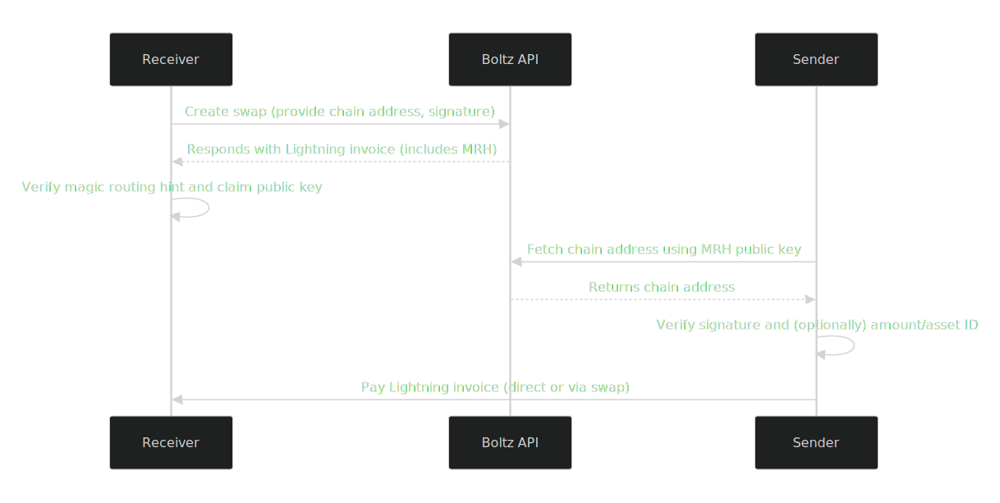

# 🪄 Magic Routing Hints

::: warning

**Advanced Feature**: MRH is an advanced feature that does not have the exact
same guarantees as a standard Boltz swap. While it provides cost savings and
slightly faster settlement, swap clients should be aware of the additional
responsibilities to recognize and verify MRH payments.

:::

This page describes the mechanism that encodes a BIP21 URI into the routing
hints section of an invoice, mainly for Boltz-powered wallets like
[Aqua](https://aqua.net/) to pay each other directly without involving a Boltz
swap and to avoid bloated, hard-to-scan BIP21 QR codes.

## Basics

While paying invoices of Reverse Swaps with Submarine Swaps is supported by
Boltz, it is not economical. To minimize the number of transactions and costs,
swap routes can be optimized or swaps can be skipped entirely and the sender can
pay the receiver directly using Magic Routing Hints, or "MRH" for short.

For instance, instead of:

- Chaining a Bitcoin -> Lightning Submarine Swap with a Lightning -> Liquid
  Reverse Swap, swap clients can instead use a Bitcoin -> Liquid Chain Swap
- Chaining a Liquid -> Lightning swap with a Lightning -> Liquid swap, swap
  clients can directly send a Liquid transaction to the receiver

The only data that the receiver and sender share in these scenarios is the
Lightning invoice. Encoding arbitrary data in an invoice is impractical, so we
add a hint to this invoice which indicates that one can fetch a chain address of
the recipient. This hint is encoded in the routing hints section of the swap's
Lightning invoice with a specific channel id. There is no actual channel with
this id, the channel as routing hint only signals to supporting wallets that the
magic routing hint feature is enabled by the recipient. The node public key in
the routing hint is the same public key with which the receiver would need to
sign to enforce the claim of the Reverse Swap.

## Steps For The Receiver

When creating a Reverse Swap with a magic routing hint, there are a few
additional steps that the receiver must take:

- In the API call to create the swap, pass a chain address of the wallet for the
  chain on which the Reverse Swap will be claimed to.
- In the API call to create the swap, pass a signature of the SHA-256 hash of
  this chain address, signed by the private key the Reverse Swap can be claimed
  with.
- When the API call returns, verify the correctness of the invoice, including
  the magic routing hint with the specific channel id and the claim public key
  in the node public key field.

### Wallet Requirements

- Use a **separate wallet** dedicated for swaps to avoid accidental address
  reuse, which can cause MRH payments to be falsely marked as settled
- Use a custom derivation path if you plan to let your users export the wallet
  for use elsewhere

It is the client's responsibility to handle payments to magic routing hint
addresses. To help clients detect these transactions as quickly as possible, we
emit [a WebSocket event](api-v2#magic-routing-hints) when we observe a
transaction in the mempool to the MRH address for a swap the client is
subscribed to.

Boltz emits a `transaction.direct` status update for MRH transactions related to
a specific swap. While these status updates are provided for convenience, swap
clients should **not** use these as the sole source of truth and always
independently verify transactions onchain before marking a swap as settled.

## Steps For The Sender

When a wallet attempts to pay a Lightning invoice via a Submarine Swap, there
are two options: either proceed with the standard Submarine Swap if no magic
routing hint is present or use the magic routing hint if it exists. If a magic
routing hint is found, then:

- Parse the public key in the routing hint.
- Send a
  [request to Boltz API](https://api.boltz.exchange/swagger#/Reverse/get_swap_reverse__invoice__bip21)
  to fetch the chain address of the receiver.
- Extract the address from the BIP21, hash the address, and verify the signature
  returned in the API call against the public key in the magic routing hint.
- Verify the amount of the BIP21 before paying to it. On Liquid, the asset id
  must be verified, too.

<figure><figcaption><p>Sequence Diagram for Receiver and Sender MRH flows</p></figcaption></figure>

## Amounts

Magic Routing Hints are designed to ensure the receiver gets the exact same
amount as with chained swaps, while allowing the sender to reduce their costs.
The amount in the BIP21 should be honored by the sender.

## Example code

```typescript
import axios from 'axios';
import { crypto } from 'bitcoinjs-lib';
import bolt11 from 'bolt11';
import { randomBytes } from 'crypto';
import { ECPairFactory } from 'ecpair';
import * as ecc from 'tiny-secp256k1';

const ECPair = ECPairFactory(ecc);

const endpoint = '<Boltz API endpoint>';

const magicRoutingHintConstant = '0846c900051c0000';
const lbtcAssetHash = '<L-BTC asset hash on the network used>';

const findMagicRoutingHint = (invoice: string) => {
  const decodedInvoice = bolt11.decode(invoice);
  const routingInfo = decodedInvoice.tags.find(
    (tag) => tag.tagName === 'routing_info',
  );
  if (routingInfo === undefined) {
    return { decodedInvoice };
  }

  const magicRoutingHint = (routingInfo.data as any[]).find(
    (hint) => hint.short_channel_id === magicRoutingHintConstant,
  );
  if (magicRoutingHint === undefined) {
    return { decodedInvoice };
  }

  return { magicRoutingHint, decodedInvoice };
};

const receiverSide = async () => {
  const preimage = randomBytes(32);
  const claimKeys = ECPair.makeRandom();

  const address = '<L-BTC address on the network used>';

  const addressHash = crypto.sha256(Buffer.from(address, 'utf-8'));
  const addressSignature = claimKeys.signSchnorr(addressHash);

  const swapRes = (
    await axios.post(`${endpoint}/v2/swap/reverse`, {
      address,
      from: 'BTC',
      to: 'L-BTC',
      invoiceAmount: 10_000,
      addressSignature: addressSignature.toString('hex'),
      claimPublicKey: claimKeys.publicKey.toString('hex'),
      preimageHash: crypto.sha256(preimage).toString('hex'),
    })
  ).data;

  // Other verification checks skipped

  const { magicRoutingHint } = findMagicRoutingHint(swapRes.invoice);
  if (magicRoutingHint === undefined) {
    throw 'no magic routing hint';
  }

  if (magicRoutingHint.pubkey !== claimKeys.publicKey.toString('hex')) {
    throw 'invalid public key in magic routing hint';
  }

  return swapRes.invoice;
};

const senderSide = async (invoice: string) => {
  const { magicRoutingHint, decodedInvoice } = findMagicRoutingHint(invoice);
  if (magicRoutingHint === undefined) {
    // Pay via Swap
    console.log('no magic routing hint found');
    return;
  }

  const bip21Res = (
    await axios.get(`${endpoint}/v2/swap/reverse/${invoice}/bip21`)
  ).data;

  const receiverPublicKey = ECPair.fromPublicKey(
    Buffer.from(magicRoutingHint.pubkey, 'hex'),
  );
  const receiverSignature = Buffer.from(bip21Res.signature, 'hex');

  const bip21Decoded = new URL(bip21Res.bip21);
  const bip21Address = bip21Decoded.pathname;

  const addressHash = crypto.sha256(Buffer.from(bip21Address, 'utf-8'));

  if (!receiverPublicKey.verifySchnorr(addressHash, receiverSignature)) {
    throw 'invalid address signature';
  }

  if (bip21Decoded.searchParams.get('assetid') !== lbtcAssetHash) {
    throw 'invalid BIP21 asset';
  }

  // Amount in the BIP21 is the amount the recipient will actually receive
  // The invoice amount includes service and swap onchain fees
  if (
    Number(bip21Decoded.searchParams.get('amount')) * 10 ** 8 >
    Number(decodedInvoice.satoshis)
  ) {
    throw 'invalid BIP21 amount';
  }

  // Pay on Liquid
};

(async () => {
  try {
    const invoice = await receiverSide();
    await senderSide(invoice);
  } catch (e) {
    console.error(e);
  }
})();
```
